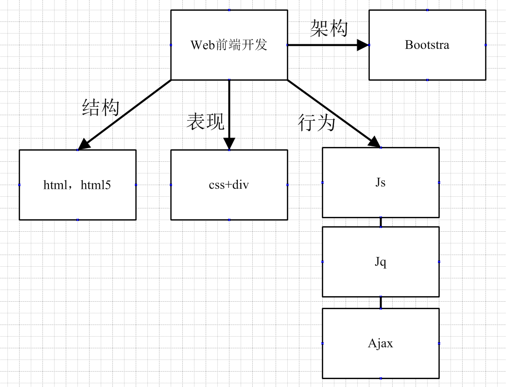

# 前端总结

---
## 1.Html
> 超文本标记语言，用来描述网页的结构，是每个web前端项目的开始.
>
> html由各种**标签**组成。

- html

    根标签，一个网页只有一个根标签，切且所有内容写在根标签中。

- head

    title网页标题标签。

- body

    主体部分，编写html标签。

- !doctype html

    html5声明，编写位置最上方。
    
- meta charset="???"

    字符集。
    
- h1 h2 h3 h4 h5 h6 

    标题标签。
    
- br

    换行。
    
- hr

    水平线。
    
- img

    图片。
    
- a

    链接
    
## 2.Css+div
> css和div是网页的表现，可以用来美化网站，可以写为内联样式，但是一般分离，用单独的css文件编写样式。

1.选择器

选择器分为很多种，最常见的三种分别为id选择器，类选择器和元素选择器。
    
    
- id选择器：#id
    
    `id="name"`
    
    `#name {`
        
    `}`
    
- 类选择器:.class
    
    `class="name"`
    
    `.name {`
    
    `}`
    
- 元素选择器:tag
    
    `

`
    
    `p{`
    
    `}`
    
- 属性选择器：[title]

    `<h2 title="Hello world">Hello world</h2>`
    
    `[title]{`
    
    `color:red;`

    `}`

    
除此以外，还有后代选择器，子选择器，兄弟选择器，选择器组等更多不同选择器的应用。

2.伪类

> CSS 伪类用于向某些选择器添加特殊的效果。
> 
> 在支持 CSS 的浏览器中，链接的不同状态都可以不同的方式显示，这些状态包括：
> 
> 活动状态，已被访问状态，未被访问状态，和鼠标悬停状态。

`a:link {color: #FF0000}`	

未访问的链接

`a:visited {color: #00FF00}`

已访问的链接

`a:hover {color: #FF00FF}`

鼠标移动到链接上

`a:active {color: #0000FF}`	

选定的链接 

3.定位

css最常用的三种定位：

1. 相对定位

`position: relative;`

设置为相对定位的元素框会偏移某个距离。元素仍然保持其未定位前的形状，它原本所占的空间仍保留。

2. 绝对定位

`position: absolute;`

设置为绝对定位的元素框从文档流完全删除，并相对于其包含块定位，包含块可能是文档中的另一个元素或者是初始包含块。元素原先在正常文档流中所占的空间会关闭，就好像该元素原来不存在一样。元素定位后生成一个块级框，而不论原来它在正常流中生成何种类型的框。

3. 固定定位

`position: fixed;`

元素框的表现类似于将 position 设置为 absolute，不过其包含块是视窗本身。

## 3.Javascript

> javascript是网站的行为，用于响应用户的操作。
>
> html中引入，且最好位于body最下方。
>
>jq是js的一个库，用于简化js代码。

- `var name`

 声明
    
- $(document).ready(function(){ }

 用于在文档加载后激活函数,js代码可以编写在其中。
$(function() {});是$(document).ready(function(){ })的简写

- onclick点击事件

 `$("name").click(function() {`
 `...`
 `});`
 
- 正则表达式

 当您检索某个文本时，可以使用一种模式来描述要检索的内容。
 实例test3中搜索功能,用于搜索页面内的文字： 
 `$(".search-button").click(function() {` 
    `var val = $(".search").val(); // 获取搜索词` 
    `if (val.length > 0) {` 
       `console.log(val` 
       ` $(".nav-1").hide(); ` 
      `$(".nav-1:contains(" + val + ")").show(); ` 
    `} else {` 
       ` alert("输入为空");` 
  ` }` 
`});` 

- setinterval 和 settimeout

 setTimeout(表达式,延时时间)在执行时,是在载入后延迟指定时间后,去执行一次表达式,记住,次数是一次
 
 而setInterval(表达式,交互时间)则不一样,它从载入后,每隔指定的时间就执行一次表达式。
 
 实例school_test: 
 
  `var timer; 
    function play1() { 
        timer = setInterval(function(){ 
            next.onclick(); 
        },3000); 
     } 
    function play2() { 
        timer = setTimeout(function () { 
            next.onclick(); 
            play2(); 
        }, 3000); 
    }` 

 清除方式：
 
 `clearTimeout(timer);`
 
 `clearInterval(timer);`
    
## 4.jQuery

> jQuery 是一个 JavaScript 库。 jQuery 极大地简化了 JavaScript 编程。

- animate()方法

 animate() 方法执行 CSS 属性集的自定义动画。
该方法通过CSS样式将元素从一个状态改变为另一个状态。CSS属性值是逐渐改变的，这样就可以创建动画效果。

 **school_test中有实例用来实现图片的轮播功能。**
 
- 选择器

 `$("p")` 选取 `
` 元素。
 
 `$("p.intro")` 选取所有 `class="intro"` 的 `
` 元素。
 
 `$("p#demo")` 选取所有 `id="demo"` 的 `
` 元素。
 
- show() and hide()事件

  实例school_test:

 `$("name").hide(); `
 隐藏
     
 `$("name").show(); `
 显示
 
- val()

 实例school_test,用于获取name选择器的值:
 
 `var val = $("name").val();`

## 5.Bootstrap

> Bootstrap，来自 Twitter，是目前最受欢迎的前端框架。
> 
> [Bootstrap教程网站][1]
>
>这个，没啥好总结的，不会就去瞅瞅教程，简单清晰又明了

![此处输入图片的描述][2]

## 6.Ajax

> 1.ajax()方法是功能最强大最齐全的请求服务器数据的方法
> 2.ajax()能够获取服务器返回的数据 
> 3.ajax()能够向服务器发送并传递数值
>> 调用的格式：jQuery.ajax([settings])或$.ajax([settings])
>> 参数[settings]为发送ajax()请求时的各项参数的配置信息，键值对的形式写入

>  [jQuery的ajax()方法 教学网站][3]

- $.ajaxSetup() 全局设置

 jQuery.ajaxSetup()函数用于设置AJAX的全局默认设置。
 该函数用于更改jQuery中AJAX请求的默认设置选项。之后执行的所有AJAX请求，如果对应的选项参数没有设  置，将使用更改后的默认设置。
 该函数属于全局jQuery对象。

- ajax() 

 ajax() 方法通过 HTTP 请求加载远程数据。
 该方法是 jQuery 底层 AJAX 实现。
 $.ajax() 返回其创建的 XMLHttpRequest 对象。
 
- ajax()参数
 
 1.**async**
类型：Boolean
默认值: true。默认设置下，所有请求均为异步请求。如果需要发送同步请求，请将此选项设置为 false。
注意，同步请求将锁住浏览器，用户其它操作必须等待请求完成才可以执行。

 2.**error**
类型：Function
默认值: 自动判断 (xml 或 html)。请求失败时调用此函数。
有以下三个参数：XMLHttpRequest 对象、错误信息、（可选）捕获的异常对象。
如果发生了错误，错误信息（第二个参数）除了得到 null 之外，还可能是 "timeout", "error", "notmodified" 和 "parsererror"。
这是一个 Ajax 事件。

 3.**data**
类型：String
发送到服务器的数据。将自动转换为请求字符串格式。GET 请求中将附加在 URL 后。查看 processData 选项说明以禁止此自动转换。必须为 Key/Value 格式。如果为数组，jQuery 将自动为不同值对应同一个名称。如 {foo:["bar1", "bar2"]} 转换为 '&foo=bar1&foo=bar2'。

 更多参数参考网站
 
 ajax实例：
 `$.ajax({
        'url': api_urls.register,
        'method': 'POST',
        'data': JSON.stringify({
            email: email,
            password: password,
            verifyCode: verify_code
        })
    }).done(function (response) {
        console.log(response);
        if (is_success(response)) {
            return;
        }
        error_tip(get_error_message(response));
    });`
 
- jquery中的ajax中的done方法
 
 该方法和ajax中的success有类似的功效。
 ajax的done。参数可以写成一个方法。是将函数本身作为done的参数

  [1]: http://www.runoob.com/bootstrap/bootstrap-tutorial.html
  [2]: https://timgsa.baidu.com/timg?image&quality=80&size=b9999_10000&sec=1526532826847&di=abfc212c725bf11b52fb505f8d75ba1f&imgtype=0&src=http://img5.duitang.com/uploads/item/201609/17/20160917131726_FcSLT.thumb.700_0.jpeg
  [3]: http://www.w3school.com.cn/jquery/ajax_ajax.asp
